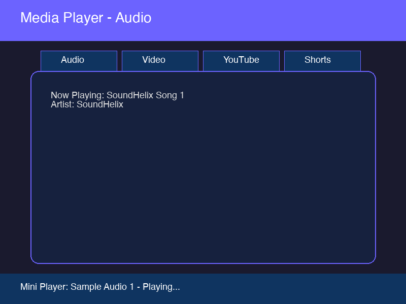
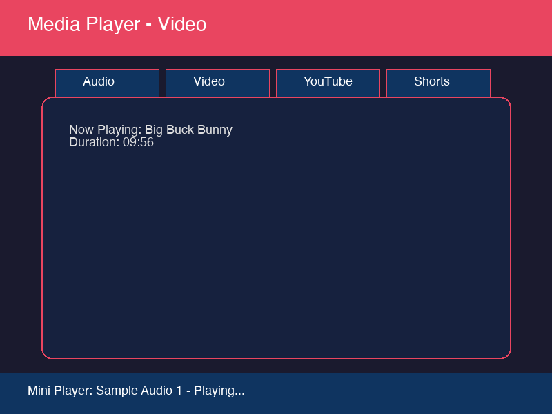
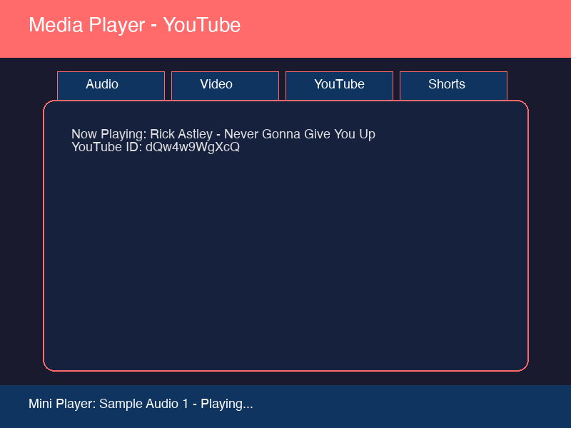
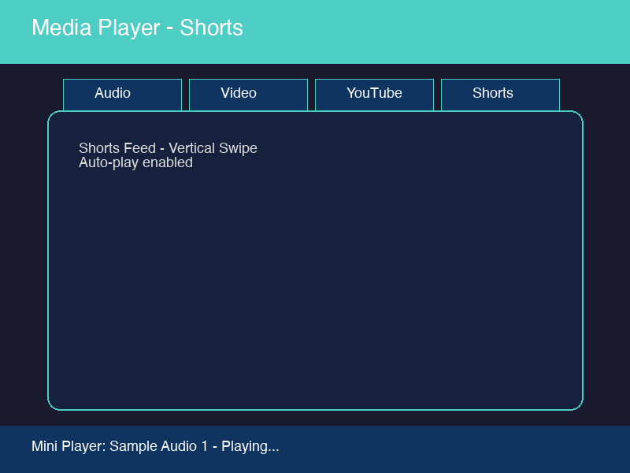

# Flutter Media Player

A Flutter app demonstrating multi-format media playback: **network audio**, **network video**, **YouTube videos**, and **YouTube Shorts**. Built with a clean provider architecture and Material 3 design.

## Screenshots

### Web - Audio Player


### Web - Video Player


### Web - YouTube Player


### Web - Shorts Feed


## Features

| Feature | Package | Status |
|---------|---------|--------|
| Audio Player (MP3/stream) | `just_audio` | ✅ Working |
| Video Player (MP4/network) | `video_player` | ✅ Working |
| YouTube Video Player | `youtube_player_iframe` | ✅ Working |
| YouTube Shorts | `youtube_player_iframe` | ✅ Working |
| Seek bar + drag support | Custom widget | ✅ Working |
| Playback speed control | Custom widget | ✅ Working |
| Volume control | Custom widget | ✅ Working |
| Queue / Playlist | `PlaylistProvider` | ✅ Working |
| Mini player | Custom widget | ✅ Working |

## Architecture

```
lib/
├── main.dart                    # App entry, MultiProvider setup
├── models/
│   └── media_item.dart          # Media metadata model
├── providers/
│   ├── media_player.dart        # Abstract base player interface
│   ├── audio_player_provider.dart
│   ├── video_player_provider.dart
│   └── playlist_provider.dart   # Queue management
├── screens/
│   ├── home_screen.dart         # Tab-based launcher
│   ├── now_playing_screen.dart  # Expanded playback view
│   ├── youtube_player_screen.dart
│   └── youtube_shorts_screen.dart
└── widgets/
    ├── mini_player.dart         # Bottom persistent player
    ├── audio_list.dart
    ├── video_list.dart
    ├── youtube_list.dart
    └── shorts_list.dart
```

### State Flow

1. User taps a media item in a list widget.
2. The appropriate provider loads media via `MediaPlayer` interface.
3. `PlaylistProvider` manages queue state and navigation.
4. `MiniPlayer` reacts via `Consumer<...>` and shows current track.
5. Tapping `MiniPlayer` opens `NowPlayingScreen` for expanded controls.

## Getting Started

### Prerequisites

- Flutter SDK `>=3.5.0 <4.0.0`
- Dart SDK `>=3.5.0`
- Chrome browser (for web)

### Installation

```bash
# Clone the repo
git clone https://github.com/govindtank/flutter_media_player.git

# Navigate
cd flutter_media_player

# Install dependencies
flutter pub get

# Run on web
flutter run -d chrome

# Or run on web-server
flutter run -d web-server --web-port 8080
```

## Dependencies

| Package | Purpose |
|---------|---------|
| `provider` | State management |
| `just_audio` | Audio playback engine |
| `video_player` | Network video playback |
| `youtube_player_iframe` | YouTube embed player |

## Tech Stack

- **Flutter 3.x+** with Material 3
- **Provider** for state management
- **just_audio** for audio playback
- **video_player** for network video
- **youtube_player_iframe** for YouTube integration

## Repo Name Suggestion

The current repo name `flutter_media_player` works, but for better discoverability and branding, consider:

**`flutter_media_player`** or **`media_player_flutter`**

These names are:
- Shorter and cleaner
- More searchable on GitHub/pub.dev
- Follow Flutter naming conventions
- More professional for a portfolio project

If you want to rename, update:
1. GitHub repo settings → Rename
2. `pubspec.yaml` `name:` field
3. All `import` statements if the package name changes
4. `README.md` clone URL

## Roadmap

See [ROADMAP.md](./ROADMAP.md) for the phased improvement plan.

## License

MIT
